# Koteika Ultra MEXC — единый план до финальной версии бота

Статус: **AUTHORITATIVE FINAL-PRODUCT ROADMAP**

Дата: **2026-08-14**

Последняя review correction: **2026-08-15**

Последний implementation checkpoint: **2026-08-16**

Independent Claude closure verdict: **`APPROVE_AS_AUTHORITATIVE`**;
remaining **P0/P1: none**. Review был read-only: без code changes, tests, network,
runtime, `.env`, commit или push.

Целевая площадка: **MEXC Futures**

Текущая ветка: `claude/codex-project-review-04581e`
Историческая closure review-base: `ad30b02` (на момент review local = upstream).
До создания draft tracked tree был clean; во время closure review draft и review
prompt оставались untracked.
Авторитетный S1 publication commit: `2a14299`. P1 contract checkpoint:
`0ff1b3a` (deterministic Min1 aggregation) → `36e1446` (strict MEXC history).
На `36e1446`: `822 passed, 4 skipped, 2` known collection warnings
(`22.94s`); independent S2/S3 review: P0/P1 none. Network, public-data pilot,
operational scanner/bot runtime, Telegram, private API и model не запускались.
Per-shard pre-pilot hardening зафиксирован как `ba8ea00` (bounded transport) →
`f8a6b5b` (restart-safe strict history v2). На `f8a6b5b`: `905 passed,
5 skipped, 2` known collection warnings (`21.80s` independent receipt);
code-scope independent red-teams: P0/P1/P2 none. Network/U5 по-прежнему не
выполнялись.

Локальный P2 run-manifest/global-budget/pure-orchestration contract опубликован
как `5595679` (parent `17b47c7`), contract pin
`f3d642d436e9d4a44e65f35c6ea8375bd92b4b36b30f1c86af54936a608ce65e`.
Receipts: focused `20 passed`; `tests/v3` — `194 passed, 1 skipped`; full —
`925 passed, 5 skipped, 2` known warnings. Два независимых review дали
P0/P1/P2 none. Это завершает только локальный pre-pilot contract slice: public
pilot, endpoint verification и U5 не выполнялись.

Этот документ объединяет:

- frozen causal foundation `mexc_strategy_v2` / journal v5-v6;
- ADR Claude по быстрому `mexc_strategy_v3`;
- независимый архитектурный, исследовательский и production/security review;
- пользовательскую торговую цель, риск и временную семантику;
- полный release path от stopped research до final signals bot и, отдельно,
  optional limited live execution.

Документ не является разрешением запускать scanner, сеть, Telegram, private API,
обучение или торговлю. Обязательный независимый read-only review завершён
вердиктом выше. Исторический
`docs/STRATEGY_AI_MASTER_PLAN_2026-08-03.md` остаётся источником текущих frozen
contracts и audit trail; противоречие разрешается в пользу фактического кода и
явно зафиксированного более нового решения.

---

## 1. Product truth и конечная цель

Koteika Ultra ищет причинно наблюдаемое истощение резкого пампа и формирует
преимущественно SHORT-сигнал. Цель — не «нейросеть, которая чувствует рынок», а
проверяемый путь:

```text
рынок
→ point-in-time evidence
→ последний наблюдаемый peak / retest / reset
→ сигнал не позже 10 минут по консервативной границе
→ deterministic one-entry / one-stop / one-TP proposal
→ Cross sizing в пределах account-risk
→ ручной или автоматизированный outcome
→ честный portfolio replay
→ baseline/model evaluation
→ prospective promotion либо NO_EDGE/INCONCLUSIVE
```

### 1.1 Три чётко разделённых release outcome

1. **Final Research Monitor — гарантированный безопасный результат.**
   Public MEXC data, causal observational candidates, evidence/monitoring; без
   actionable trade recommendation.
2. **Final Actionable Signals Bot — цель только при доказанном edge.**
   Signal cards, ручной вход, Cross-risk calculator, local paper ledger,
   operator ACK, monitoring и rollback. Trade key отсутствует.
3. **Optional Execution Bot — отдельный будущий release.**
   Private MEXC adapter, reconciliation, venue-side protection, kill switches и
   staged live. Он не включается автоматически после выпуска Signals Bot.

Если устойчивый prospective edge не подтверждается, корректным финальным
результатом остаётся **Final Research Monitor**: он может журналировать и
показывать observational candidates, но не выдаёт actionable entry/size/SL/TP и
не называется Final Signals Bot. Actionable Final Signals Bot разрешён только
после `EDGE_CONFIRMED_PROSPECTIVE` и operational validation.

### 1.2 Зафиксированная пользовательская цель

```text
exchange                         = MEXC Futures
direction                        = SHORT pump exhaustion
signal market-peak SLA           <= 600 sec
typical realization              = 1–30 min, иногда дольше
margin mode                      = Cross
selected exchange leverage       = 100x, если допустимо инструментом
max effective account leverage   = 1.0x
reference equity                 = 100 USDT
planned account-loss budget      <= 5% equity
preferred planned stop distance  <= 4%
absolute planned trigger cap     <= 5%
global executable concurrency    = 1
DCA / averaging                  = prohibited
```

100x уменьшает initial-margin requirement, но не увеличивает допустимый
notional. Реальный stop-market fill при гэпе нельзя гарантировать ровно в 5%; в
sizing обязаны входить stress overshoot и издержки.

---

## 2. Текущая доказательная граница

### 2.1 Frozen и сохраняется без изменения

| Граница | Текущий статус |
|---|---|
| `mexc_strategy_v2` | frozen Min60/45-hour no-edge control |
| StrategySpec contract / default instance | `9c62b88b…e3dd` / `9f0b2d70…9466` |
| Journal v5 | frozen read-only compatibility |
| Journal v6 | current writer for the frozen v2 line; semantics closed to v3 |
| CycleEnvelope | v3, version-dispatched StrategySpec evidence |
| Causal cycle identity | v5 |
| Feature contract | `mexc_reversal_features_v2`, `20f9f61d…c496c` |
| Candidate lifecycle | `candidate_lifecycle_v1`, `cc75c871…551` |
| Frame provenance | `mexc_closed_frame_provenance_v1`, `f4004ac9…dbf` |
| Single-position replay | frozen schema v3; `ReplayEvidence` обязателен на scored-candidate/portfolio-selection boundary |

V2 и single-position v3 остаются control/compatibility fixtures. V3 не меняет
их parser, payload, hashes, paths или semantics. Новый execution/risk/outcome
контракт требует version-dispatched `single_position_v4` либо отдельных
`SizingPolicyV1` + `ExecutionStressContractV1` + `OutcomeEvidenceV1` с точным
adapter к frozen v3; новые semantics нельзя приписывать v3.

### 2.2 Что не является admissible v3 evidence

Commit `ad30b02` добавил полезную process-parallel механику offline build, но его
output остаётся **legacy/discovery-only**:

- Min60/Hour4 input и Min5 forward path;
- permissive `calibration_config()`;
- event-conditioned rows;
- legacy `label_event` и default 48-hour labels;
- не journal-v6 runtime population и не executable v3 proposal labels.

Повторно использовать разрешено только проверенную механику deterministic symbol
ordering, process isolation, atomic shard completion и resume. Claims/labels из
этого builder не используются для admission.

### 2.3 Текущий verdict

- Generic pump-fade edge после costs не установлен.
- Модель не обучена и не включена.
- Scanner/bot остановлен.
- Private MEXC execution adapter отсутствует.
- Исторические credentials не ротированы; Telegram/private/testnet/live закрыты.
- Current gate-conditioned missingness запрещает model fit.

---

## 3. Неподвижные correctness и safety invariants

1. Только данные, доступные к `decision_as_of_ts`.
2. Один глобальный causal clock; per-source closed boundaries выводятся из него.
3. Peak никогда не выбирается по будущему global maximum.
4. Full denominator: included, excluded, no-data, error, HOLD и non-signal rows.
5. Feature snapshot вычисляется независимо от раннего rule exit.
6. Missing не заменяется нулём и не кодирует место падения gate.
7. Один global open position; no hindsight runner-up substitution.
8. Risk governor может только уменьшить размер или дать `ABSTAIN`.
9. ML/LLM не задают side, leverage, quantity, stop, TP или order action.
10. Незаякоренная hash-chain называется internally consistent, не tamper-proof.
11. Final holdout открывается один раз для frozen candidate.
12. Недостаток power означает `INCONCLUSIVE`, а достаточный отрицательный
    результат — `NO_EDGE_FOR_FROZEN_HYPOTHESIS`.
13. Любая новая semantics получает новую version/hash/fixture.
14. Никакого live без rotation, prospective edge, reconciliation и kill switch.

---

## 4. Целевая архитектура

```mermaid
flowchart LR
    A["MEXC public raw data"] --> B["Immutable raw store + manifests"]
    A --> C["Point-in-time universe + instrument specs"]
    B --> D["Full-universe lightweight Min1 discovery"]
    B --> E["Deterministic aggregation"]
    E --> F["Min5 / Min15 / Min60 / Hour4 context"]
    C --> G["V3FastUniverseLedgerV1"]
    D --> G
    C --> H["V3ContextLedgerV1"]
    F --> H
    G --> I["PeakEpisodeV1: episode + level + attempt"]
    H --> J["Unconditional FeatureSnapshotV3"]
    I --> K["Unsigned / unsized StrategyProposal geometry"]
    J --> K
    K --> L["RuleEvaluation + optional model prediction"]
    L --> M["Deterministic sizing / risk governor"]
    M --> N["Global one-position arbiter"]
    N --> O["Signal card / paper / optional executor"]
    O --> P["V3TradeOutcomeLedgerV1"]
    P --> Q["Portfolio replay + causal dataset"]
    Q --> R["Baselines → LightGBM/EV → challengers"]
```



### 4.1 Runtime planes и trust domains

```text
Public scanner/research plane
        ↓ canonical snapshot/proposal
Deterministic risk governor
        ↓ bounded intent
Manual signal path OR separate sandboxed MEXC executor process

Notifier             = отдельный credential/domain
Private observer     = отдельный read-only credential/domain
Executor             = единственный holder trade permission
LLM text extractor   = sandbox без account/order access
```

Daily development и runtime не зависят от `D:\` или подключённой флешки.
Same-disk checkpoint поддерживает rollback, но до live обязателен encrypted
off-device disaster-recovery checkpoint.

---

## 5. Causal time и signal SLA

### 5.1 Часы

```text
cohort_market_cutoff_ts
decision_as_of_ts := cohort_market_cutoff_ts
expected_closed_boundary_ts(timeframe, cohort_market_cutoff_ts)
sla_reference_attempt_id = proposal-linked latest peak_attempt_id
sla_reference_bar_open_ts / sla_reference_bar_close_ts
sla_reference_observed_at
attempt_deadline_ts = sla_reference_bar_open_ts + 600
pre_alert_recheck.request_started_at / received_at / source_as_of
decision_completed_ts
actionable_ts
alert_published_locally_at
alert_request_started_at
alert_provider_accepted_at
actionable_channel_id
actionable_delivery_at
operator_ack_at
entry_valid_until_ts = actionable_delivery_at + 300
research_entry_eligible_ts
manual_entry_ts
research_entry_bar_open_ts
```

```text
market_peak_latency_lower = actionable_delivery_at - sla_reference_bar_close_ts
market_peak_latency_upper = actionable_delivery_at - sla_reference_bar_open_ts
publication_lag =
  sla_reference_observed_at - sla_reference_bar_close_ts
operational_latency =
  actionable_delivery_at - sla_reference_observed_at
```

Primary cohort допускает alert только при:

```text
market_peak_latency_upper <= 600 sec
```

`cohort_market_cutoff_ts` фиксируется один раз на Min1 boundary и одинаков для
всех symbols одного fast cohort; wall-clock отдельного worker не является
decision clock. Для каждого source boundary выводится только из этого clock.
Обязательные инварианты:

```text
decision_as_of_ts = cohort_market_cutoff_ts
sla_reference_bar_close_ts <= sla_reference_observed_at
source_event_end_ts <= expected_closed_boundary_ts <= cohort_market_cutoff_ts
feature/confirmation/score/rank evidence.source_as_of <= decision_as_of_ts
feature/confirmation/score/rank evidence.received_at <= decision_completed_ts
decision_completed_ts >= max(all decision evidence.received_at)
actionable_ts = max(
  decision_completed_ts,
  pre_alert_recheck.received_at,
  all decision evidence.received_at
)
alert_request_started_at >= actionable_ts
alert_provider_accepted_at >= alert_request_started_at
actionable_ts <= actionable_delivery_at
provider channel: actionable_delivery_at = alert_provider_accepted_at
local channel: actionable_delivery_at = durable_local_publication_commit_ts
```

`actionable_delivery_at` обязан быть durable receipt самого выбранного channel и
не может выводиться из `decision_completed_ts` или `actionable_ts`.

Initial high, equal-tick retest и strictly higher high обязаны использовать один
и тот же proposal-linked `sla_reference_attempt_id` для deadline и SLA.

Pre-alert recheck имеет отдельный `revalidation_as_of_ts = source_as_of`. Он
может только veto/invalidate уже сформированный proposal. Он не может повысить
score, подтвердить candidate, изменить rank, починить missing feature или создать
proposal, отсутствовавший к `decision_as_of_ts`. Его receipt входит в
`actionable_ts` только как execution-safety barrier. Point snapshot доказывает
лишь цену в его source/receipt moment, а не отсутствие промежуточного higher high.

Alert после `attempt_deadline_ts` получает `SLA_INELIGIBLE`, даже если сам сигнал
качественный. HTTP 200 Telegram означает provider acceptance, не доставку и не
прочтение. Local publish, provider acceptance и operator ACK — разные clocks;
ACK не входит в market-peak SLA, но входит в operational/manual metrics.

`actionable_delivery_at` зависит от frozen channel policy: в local research это
durable local publication commit, в Telegram — provider acceptance. Retry или
второй channel не продлевает уже созданный proposal. SLA хранится отдельно для
каждого заявленного actionable channel; финальный operator-channel SLA нельзя
подменить local sink.

`entry_valid_for_sec=300` не является предполагаемой задержкой человека.
`manual_entry_latency_sec` — отдельный preregistered параметр:

```text
research_entry_eligible_ts =
  actionable_delivery_at + manual_entry_latency_sec
```

Research fill использует первую причинно достижимую цену в/после этого времени,
не позже `entry_valid_until_ts`, после повторной проверки peak, entry band и
instrument spec. Лучшую цену внутри пяти минут выбирать запрещено.

### 5.2 Timeframe roles

```text
Min1   = full-universe peak discovery + confirmation resolution
Min5   = pump shape / exhaustion
Min15  = intraday context
Min60  = broad regime
Hour4  = higher-timeframe context
```

Event/state horizons и estimator/warm-up budgets задаются отдельно. Нельзя
механически переносить RSI/ATR/EMA/VP bar counts вместе с pump/confirmation
duration.

### 5.3 Scheduler

- boundary-driven Min1 cycles; никакого sleep-after-work drift;
- full-universe lightweight discovery, а не SLA только для старого watchlist;
- дорогие MTF reads/features — после дешёвого causal trigger;
- exact start/fetch/decision/recheck/alert budgets;
- `MISSED_CYCLE`, `OVERRUN`, stale context и incomplete universe пишутся durable;
- cycle overlap запрещён или детерминированно coalesced;
- p50/p95/p99 latency и coverage являются release metrics;
- fail-closed, если cohort не завершён к deadline.

SLA metrics имеют явные denominators, а не только отправленные alerts:

```text
late_confirmed / all_confirmed
sla_ineligible / all_candidate_attempts
missed_or_incomplete_fast_cycles / all_expected_fast_cycles
```

Если whole-universe coverage технически недостижимо, продукт обязан либо сузить
заявленную universe point-in-time policy, либо остановить v3 release. Нельзя
молча заявлять SLA всей биржи по watchlist-only данным.

---

## 6. PeakEpisodeV1 и restart

### 6.1 Identity

```text
peak_episode_id = H(
  venue, venue_symbol, detector_interval,
  strategy_spec_instance_hash,
  immutable_formation_or_first_peak_event_identity
)

peak_level_id = H(
  peak_episode_id, tick_normalized_peak_price
)

peak_attempt_id = H(
  peak_level_id, attempt_bar_open_ts, attempt_bar_close_ts,
  immutable_detector_source_bundle_hash
)
```

- новый независимый pump episode на том же ценовом tick получает новый
  `peak_episode_id`, поэтому не сталкивается с историческим episode;
- строго больший tick → новый level и attempt;
- равный tick → `RETESTED`, тот же level, новый attempt;
- proposal ссылается на последний attempt event commit;
- formation сохраняет исходный peak event window и не перезапускает deadline;
- `attempt_deadline_ts = attempt_bar_open_ts + 600`; formation не меняет deadline
  существующего attempt, а retest/new high создаёт новый attempt и новый deadline;
- `remaining_budget_sec = attempt_deadline_ts - decision_as_of_ts`;
- одновременно новый high и слабый close → adverse-first reset;
- pre-alert recheck имеет именованный источник и собственный provenance.
- OHLC Min1 не доказывает порядок high/close внутри одного бара: confirmation
  разрешён только строго более поздним закрытым Min1 bar. Same-bar confirmation
  возможен лишь в будущей версии с ordered trade-stream evidence.

### 6.2 States

```text
PRE_FORMATION_HIGH
→ PEAK_CANDIDATE
→ RETESTED / SUPERSEDED
→ ARMED
→ CONFIRMED / EXPIRED / LATE_FORMATION / SLA_INELIGIBLE
→ PROPOSAL
→ FILLED / PROPOSAL_LAPSED / INVALIDATED_BEFORE_ENTRY
```

`peak_level_id`, `peak_attempt_id` и frozen `candidate_lifecycle_v1` — разные
identities. Их связывает versioned immutable link event; одно поле `candidate_id`
не переиспользуется для двух contracts.

### 6.3 Restart

Persisted state является materialized projection append-only ledger:

1. validate chain/checkpoint;
2. rebuild last state;
3. fetch/replay every missing closed Min1 bar in causal order;
4. gap → `STATE_RECOVERY_FAILED` / `LABEL_UNAVAILABLE_GAP`;
5. никакого silent continuation или нового таймера от restart wall-clock.

---

## 7. V3 evidence topology

### 7.1 `V3FastUniverseLedgerV1`

- point-in-time universe и raw contract population;
- inclusion/exclusion/not-observed reason;
- every expected Min1 cohort и row каждого contract;
- exact full-universe Min1 discovery evidence;
- detector outcome: no-data/error/HOLD/formation-eligible/candidate;
- fast-cycle clock, coverage, missed/overrun state;
- immutable commit, на который ссылаются peak events.

Peak ledger может быть event-oriented только потому, что полный minute
denominator хранится здесь. Нельзя восстанавливать denominator из одних
candidate/proposal events.

### 7.2 `V3ContextLedgerV1`

- exact parent fast-universe commit/cohort;
- instrument rules: contract size, tick/quantity step, minimums, leverage/risk
  tier, source timing, content hash;
- Min5/15/60/4h context evidence;
- aggregation contract/hash;
- context freshness и `context_valid_until`;
- unconditional `FeatureSnapshotV3`;
- watchlist/admission decisions как metadata, не population filter.

### 7.3 `V3PeakProposalLedgerV1`

- `FastCycleEnvelopeV1` и `fast_cohort_id`;
- exact minute boundary и source timings;
- peak level/attempt events и predecessor commits;
- confirmation/reset/recheck;
- RuleEvaluation, ShadowPrediction reference и proposal;
- notification evidence;
- parent binding:

```text
fast_parent_ledger_id / sequence_no / event_commit / cohort_id
context_parent_ledger_id / sequence_no / event_commit / snapshot_id
context_valid_until
fast_parent_checkpoint_trust / context_parent_checkpoint_trust
v3_raw_input_bundle_hash
```

### 7.4 `V3TradeOutcomeLedgerV1`

- proposal lapse/no-fill;
- actual/manual or research entry mode;
- entry/exit price, quantity and timestamps;
- fees, spread, slippage, funding, gap overshoot;
- TP/STOP/HORIZON outcome;
- MAE/MFE/time-to-event и peak-breach evidence;
- exact proposal, instrument, cost, sizing and forward-data manifests.

Каждый ledger обязан иметь canonical serialization, schema/event versions,
domain-separated chain, interprocess lock, fsync, idempotency, duplicate/fork
rejection, torn-tail policy, restart validation и detached checkpoint receipt.
External trust требует anchor вне writable runtime trust-domain.

V6 остаётся исключительно frozen v2-control; v3 не пишет новые semantics в его
rows или feature contract.

---

## 8. Data pilot и immutable data lake

### 8.1 Pre-pilot code boundary

До network action:

1. ADR/schema approved;
2. strict history collector;
3. aggregation contract;
4. focused + full regression tests;
5. отдельное пользовательское разрешение на public-data pilot.

Пункты 1–4, bounded per-shard hardening и локальный run-level manifest/global-
budget/pure-orchestration contract выполнены и зафиксированы в S1–S3,
`ba8ea00`/`f8a6b5b` и `5595679`. Пункт 5 (`U5`) не предоставлен и не выводится
из разрешения менять код. Поэтому этот checkpoint не разрешает ни один запрос
к MEXC.

Current Futures API domain должен быть проверен по официальной документации
непосредственно перед запуском. MEXC объявил переход Futures API с
`contract.mexc.com` на `api.mexc.com`; interface parameters сохранялись:
<https://www.mexc.com/announcements/article/futures-api-access-domain-update-17827791532974>.
Текущий legacy client всё ещё содержит старый domain и намеренно не изменён.
`ba8ea00` добавил отдельный versioned candidate fixture для
`api.mexc.com/api/v1/contract/kline/{venue_symbol}`, но fixture прямо фиксирует
`candidate_not_u5_verified`: он не подтверждает ни актуальную официальную
документацию, ни live endpoint. Реального/default network executor нет.
`5595679` заморозил candidate identity и bounded ordered verification
procedure/expected receipt в manifest contract, но не создал concrete run
instance и не предоставил network authority. После отдельного U5 первые
ограниченные действия выполняются строго по порядку: current official-reference
verification, затем exact live one-closed-Min1-bar probe. Любой mismatch означает
STOP до любого history acquisition.

### 8.2 Strict collector

**Implemented P1 receipt — `36e1446`.** Контракт
`mexc_strict_history_v1` pinned к
`6c17bd9de3e25210139da4491a1f35fbd0cec557707fb5d376a60ce23e04c6c1`.
Отдельный v3-only collector не меняет legacy `HistoryCollector`, frozen v2,
текущий cache или endpoint defaults. Он не содержит default network transport
и требует явных transport и storage root.

- typed network/HTTP/JSON/API/payload failures;
- error никогда не становится empty/no-data;
- every expected timestamp audited;
- explicit `IncompleteRangeError` при exhaustion/max-pages;
- closed UTC boundary;
- mandatory OHLCV + exact `amount` turnover;
- no gap fill;
- same-volume temp + file fsync + atomic hardlink/no-overwrite; parent-directory
  fsync is best-effort on Windows and restart verification remains mandatory;
- request/page receipts;
- immutable raw response bytes либо content-addressed raw payload с request
  parameters, HTTP/API status, `received_at` и content hash;
- normalized shard ссылается на exact raw page hashes;
- schema явно фиксирует `volume` как exchange-reported contract count и quote
  `amount` как exact turnover; base-volume conversion не заявляется без
  point-in-time `contractSize`; это проверяется payload fixtures;
- separate pilot path, no mutation current cache.

**Per-shard pre-pilot hardening receipt — `ba8ea00` → `f8a6b5b`.**

- endpoint candidate `mexc_futures_kline_endpoint_candidate_v1`:
  `54f57d755cd679eb92444d48b38013621caad37067125e80cf7c5e45fe2ab220`;
- limits `mexc_history_resource_limits_v1`:
  `937d053e33c513d128389259e308156c8758e5cfe44b5849e3eb27ea49d96bdc`;
- retry policy `mexc_history_retry_policy_v1`:
  `78f92d14cc26ead1a372d840a05fe8a60dae97d5d9a3cdacc539a098194a2cc9`;
- transport `mexc_futures_raw_transport_v1`:
  `7d3bd40c6753e7bda2f1904ce2ffa2ff55770ecce9ba6d5614d2b30ae0664d22`;
- collector/storage `mexc_strict_history_v2`:
  `cce9922317ec5f0008f3b293103f9f5a17504b7143f81af1845d9d4765c44086`.

Transport использует только injected streaming executor, ограничивает каждую
попытку, страницу и range-shard, повторно валидирует pacing/backoff/
`Retry-After`, сохраняет bounded evidence каждой обработанной попытки,
возвращённой collector, и не превращает transport failure в no-data. Abrupt
process death может оставить incomplete shard, но не positive admission.
Immutable `scope.json` связывает
strict-history-v2 root с одним exact `HistoryRangeRequestV2` для проверяемого
restart; process-local + OS lock и owner-thread guard удерживаются от pristine
check до admission среди cooperating writers; adversarial filesystem
replacement/TOCTOU вне этого контракта. Manifest сам по себе не является success: positive
admission появляется только после полного fresh disk reload всего
raw/attempt/normalized/manifest graph. Resume/repair и cross-request reuse
запрещены.

Windows profile доказывает atomic create-new/no-overwrite visibility и
process-crash/fresh-restart verification. Он не обещает parent-directory или
sudden-power-loss durability. Per-shard limits не являются global/full-universe
budget.

### 8.3 QA pilot

- BTC + 8–10 symbols: liquidity, age, contract size, gaps/new listing;
- 7–14 days Min1 for all pilot symbols;
- at least one 140-day deep pagination probe;
- native Min60 control;
- instrument metadata/funding/OI where source is public and typed;
- exact start/end, expected/actual rows, gaps, duplicates and SHA-256 manifests.

Min1 aggregation:

```text
open=first, high=max, low=min, close=last,
volume=sum, turnover=sum
```

Только полные UTC-aligned groups. Derived bar становится доступен после receipt
всех входящих Min1 rows и наследует raw manifest/timing. Native-vs-derived
сравнение gap-aware и по preregistered tick/numeric tolerances, не byte equality.

**Implemented P1 receipt — `0ff1b3a`.** Контракт
`mexc_min1_aggregation_v1` pinned к
`0d851b253cde913d95a693e0db7296b59ff78a6048bacb20838386f2e8e20a21`.
S2→S3 adapter связывает complete S2 manifest, exact raw-page hash и normalized
consumed-row hash; изменение frame при прежних receipts отклоняется. Агрегация
не выполняет network action и не является доказательством edge.

Локально реализованы candidate endpoint identity, per-shard resource caps,
streaming body bounds, pacing/backoff/`Retry-After`, exact epoch+monotonic
microsecond evidence, safe public headers, typed failure/storage errors, strict
restart reload/admission и честная Windows durability boundary. S2v2→S3 adapter
проверяет source-close в integer microseconds до float projection и связывает
complete v2 manifest с exact normalized-row hashes. Напрямую вручную
сконструированный aggregation-v1 receipt сохраняет frozen float tolerance и не
является разрешённым pilot ingestion path.

**Локальный P2 run-level contract receipt — `5595679` (parent `17b47c7`).**
Контракт `mexc_public_qa_pilot_run_v1` pinned к
`f3d642d436e9d4a44e65f35c6ea8375bd92b4b36b30f1c86af54936a608ce65e`.

- immutable canonical QA manifest связывает repository/docs, endpoint candidate,
  exact ordered `HistoryRangeRequestV2` shards и unique fresh relative roots;
- composition требует BTC + 8–10 других symbols, 7–14d Min1 QA, минимум один
  140d Min1 probe и native Min60 controls;
- global attempts/raw/storage/output/runtime/sleep/inventory caps, serial
  concurrency `1/1`, worst-case reservations и per-step disk preflight являются
  частью manifest, а не defaults executor;
- detached U5 receipt обязан совпасть с exact manifest и оставаться достаточным
  для всего remaining serial worst-case window; manifest сам U5 не предоставляет;
- endpoint verification — первый ordered bounded stage: official reference →
  exact one-closed-bar live probe → durable reload/anchor; failure означает STOP;
- pure immutable state contract не содержит real/default executor, не запускает
  сеть и не допускает partial run как success;
- focused `20 passed`; `tests/v3` — `194 passed, 1 skipped`; full — `925 passed,
  5 skipped, 2` known warnings; два независимых review: P0/P1/P2 none.

Этот receipt завершает локальный run-manifest/global-budget/pure-orchestration
slice, но **не** public Min1 QA pilot: concrete symbols/dates/caps, executor
results, live endpoint evidence и U5 в commit не зафиксированы.

Перед U5/public pilot всё ещё обязательны:

- intentionally supplied executor/storage implementation, не встроенный default;
- exact concrete immutable manifest instance с symbols, dates/ranges, caps,
  output root и executor/storage identities, отдельно предъявленный пользователю;
- явное принятие Windows sudden-power-loss boundary либо более сильный storage
  profile;
- отдельное разрешение U5.

Следующий разрешённый slice до такого review остаётся полностью локальным: код
executor/storage и concrete manifest можно подготовить и проверить fake/offline
receipts, но нельзя выполнять official-reference fetch, live one-bar probe или
любой acquisition request.

Pilot проверяет data mechanics, coverage, latency, rate и storage. Он не
используется для заявления edge.

### 8.4 Full collection

После pilot:

- immutable raw/normalized/derived partitions по venue/symbol/date;
- point-in-time listing/delisting evidence, где доступно;
- survivor-conditional history явно помечается, разрешена только для engineering,
  train и exploratory dev и не может быть final holdout/admission evidence;
- final holdout требует доказуемую point-in-time universe либо prospectively
  collected immutable universe snapshots;
- Parquet + DuckDB + manifests; DVC только при доказанной необходимости;
- raw version не перезаписывается;
- внешний checkpoint для prospective population.

---

## 9. FeatureSnapshotV3 и strategy hypothesis

### 9.1 Feature contract

Population boundary фиксируется до outcome:

```text
raw_contract_population =
  каждый point-in-time contract каждого полного Min1 fast cycle

pump_formation_eligible_population =
  все rows, прошедшие один frozen causal admission trigger,
  вычислимый только из full-universe Min1 evidence до RuleEvaluation
```

Дорогие MTF sources разрешено загружать только для второй population. Однако
внутри неё **все** causal features вычисляются безусловно до последующих rule
gates либо имеют честные:

```text
value | observed | availability_reason | source_time | source_identity | role
```

Группы:

- pump velocity/shape, peak age, retrace;
- wick/body/acceleration/exhaustion;
- volume и exact turnover surprise;
- ATR/volatility;
- normalized VWAP/VP/Fibonacci/overhead distances;
- weakness/divergence;
- funding;
- OI только после contract-size/notional normalization;
- BTC relative strength/regime;
- public depth/trades/aggressor flow только при реальном источнике;
- Min15/Min60/Hour4 context.

Action, rule result, future label, operator reaction и model output не являются
market features. Proposal geometry является conditioning input только для
proposal-conditioned outcome/EV head, но исключается из pure-direction head.
Rows вне formation population остаются в raw denominator с
`admission_status=NOT_FORMATION_ELIGIBLE`; они не маскируются как model rows с
искусственно missing MTF features. Causal pre-decision eligibility допустима;
conditioning по future outcome, final signal или месту падения gate запрещён.

### 9.2 Provisional v3 parameters

```text
detector                    = Min1
pump formation primary      = trailing 30 min evaluated causally
additional formation view   = 60 min context
max market-peak SLA         = 600 sec
entry validity              = 300 sec
max effective leverage      = 1.0x
global concurrency          = 1
```

Formation window — trailing history available at each Min1 boundary, а не
ожидание 30 минут после peak. Event horizons и indicator warm-up фиксируются
раздельно. Exact confirmation/threshold parameters входят в preregistered
train/dev hypothesis budget, не выбираются по final holdout.

---

## 10. Proposal, Cross risk и outcome

### 10.1 Deterministic proposal

```text
FeatureSnapshotV3
→ deterministic unsigned/unsized StrategyProposal geometry
→ RuleEvaluation and optional proposal-conditioned outcome/EV prediction
→ policy/ranking
→ deterministic sizing/risk governor
→ global slot reservation
```

Proposal geometry содержит one SHORT entry, one structural stop, one take
profit, no averaging, explicit entry mode/validity, point-in-time instrument
spec и exact cost/sizing/horizon contract hashes. Pure-direction head может идти
от FeatureSnapshot напрямую; EV-head, использующая stop/TP geometry, запускается
только после создания unsigned/unsized geometry. Так устраняется причинный цикл.

Research entry остаётся детерминированным; окно 300 секунд не даёт права
выбрать лучшую цену задним числом.

### 10.2 Sizing

```text
research starting_equity = 100 USDT
research equity_before_trade = terminal equity of the same calendar portfolio
                               immediately before proposal
research_stage_risk_cap_usdt = 5 USDT
research risk_budget = min(5 USDT, 0.05 * equity_before_trade)

manual card equity = fresh operator-attested equity
private equity     = privately reconciled equity
release risk_budget = min(stage_risk_cap_usdt, 0.05 * applicable equity)

N_final = maximum rounded-down notional satisfying all:
  exact loss at structural stop stressed fill <= risk_budget
  exact loss at 5% adverse stressed fill       <= risk_budget
  N / equity                                   <= 1.0
  point-in-time instrument/risk-tier limits
```

Research, operator-attested и privately reconciled equity modes не смешиваются
в одном evaluation receipt. Release-stage caps могут только уменьшить research
cap без новой отдельно утверждённой RiskPolicy version.

Расчёт включает entry/exit fees, half-spread, normal slippage, stop-gap
overshoot, funding reserve и всю допустимую manual `entry_price_band`. После
quantity rounding обе losses пересчитываются; любое превышение → `ABSTAIN`.

`stage_risk_cap_usdt` — versioned absolute per-trade cap текущего release stage,
а не скрытая env-настройка. До private observer это лишь условная гарантия при
зафиксированных operator assumptions. Для actionable manual входа обязательны:

- dedicated empty MEXC Futures subaccount без иных positions/entry orders;
- fresh operator attestation equity, Cross mode и отсутствия иной exposure;
- known maintenance/risk tier и liquidation estimate;
- protective stop + stress buffer существенно раньше liquidation boundary;
- unknown account/instrument/liquidation state → non-actionable research card or
  `ABSTAIN`.

`operator_attestation_max_age_sec` и
`min_stop_to_liquidation_buffer_{pct,ticks}` являются обязательными versioned
RiskPolicy fields; слова «fresh» и «существенно раньше» не являются acceptance
criteria. Exact значения фиксируются до P12B.

В signals-only карточке указываются reference equity, допустимая entry band,
safe quantity/notional, stop, TP, expiry, invalidation и assumptions. Если
оператор входит вне band, старый size считается недействительным.

### 10.3 Outcomes

```text
terminal trade outcomes:
  TP_FIRST | STOP_FIRST | HORIZON_EXIT

execution/no-trade statuses:
  NO_FILL | PROPOSAL_LAPSED | INVALIDATED_BEFORE_ENTRY

unavailable/censored:
  RIGHT_CENSORED_DATA_END
  LABEL_UNAVAILABLE_DATA_GAP
  LABEL_UNAVAILABLE_DELISTING
  STATE_RECOVERY_FAILED

safety evidence:
  peak_breach_before_entry
  peak_breach_before_tp
  peak_breach_before_trade_exit
  MAE/MFE before terminal exit
  shadow MAE/MFE from entry_fill_ts to entry_fill_ts+24h,
  separately from primary PnL
```

Peak breach — обязательный safety failure, но не автоматический exit до
отдельного versioned policy decision. При неразрешимом intrabar TP/SL порядке —
adverse-first либо более granular data; hindsight best-case запрещён.

Intervals:

```text
proposal_terminal_ts =
  entry_fill_ts | invalidated_at | lapsed_at | no_fill_decided_at

peak_breach_before_entry:
  [proposal_actionable_ts, proposal_terminal_ts)
  while proposal status is not FILLED

peak_breach_before_trade_exit:
  [entry_fill_ts, terminal_exit_fill_ts)

peak_breach_before_tp:
  after fill until min(TP touch, terminal exit), otherwise nullable with
  observation_end_ts + availability_reason
```

Comparisons используют tick-normalized prices; post-exit breach относится только
к shadow diagnostics. Если breach случился до fill, terminal status =
`INVALIDATED_BEFORE_ENTRY`, `entry_fill_ts=null`, trade outcome отсутствует; это
proposal/no-trade evidence, не entered-trade label.

### 10.4 Holding recommendation pending user sign-off

Recommended research primary:

```text
max_holding = 4h with executable HORIZON_EXIT
shadow observation = 24h, не меняет primary PnL
```

При утверждении U1:

```text
primary_horizon_ts = entry_fill_ts + 4h
HORIZON_EXIT = первая причинно достижимая цена в/после primary_horizon_ts
               + exit fee/spread/slippage
shadow_end_ts = entry_fill_ts + 24h
primary label interval = [proposal_actionable_ts, terminal_exit_fill_ts]
```

Shadow не удерживает busy slot. Если shadow используется не только как diagnostic,
а для target/tuning/admission, он становится частью label interval и расширяет
purge/embargo минимум до 24h.

Если принудительный 4h exit не соответствует реальной торговле, до Phase 6
должен быть утверждён другой конечный horizon. `TIMEOUT_OBSERVED` без exit не
освобождает slot и не может завершить portfolio ledger.

---

## 11. Causal evaluation и anti-overfit

### 11.1 Populations

1. `raw_contract_population`;
2. `fast_scan_valid_population`;
3. `pump_formation_eligible_population`;
4. `context_requested_population`;
5. `context_complete_or_typed_missing_population`;
6. `feature_valid_population`;
7. `proposal_eligible_population`;
8. `entered_trade_population`.

Переходы и denominators сохраняются явно. Нет event-only training population.
`context_requested_population` равна frozen causal formation population, кроме
явно journaled scheduler/source failures.

### 11.2 Baseline ladder

1. No-trade economic zero.
2. Frozen v2/Min60 control.
3. Simple preregistered Min1 heuristic.
4. Always-short causal pump-eligible candidate.
5. `RandomRanking`: same `fast_cohort_id`, same causal proposal-eligible set,
   frozen seeds/distribution; future no-fill leader never promotes a runner-up.
6. `RandomTiming`: causal eligible-minute population, preregistered matching by
   symbol/liquidity, UTC-time and frozen regime; calipers/replacement/seeds fixed.
7. Constant prior.
8. Regularized logistic regression.
9. LightGBM outcome + separate EV head.

Все получают одинаковые entry latency, proposal geometry, costs, sizing,
calendar, universe policy и concurrency-one.

`RandomTiming` сохраняет то же число opportunity decisions, calendar
availability, entry-validity, busy-slot и no-fill/lapse rules. Он randomizes
только заранее разрешённый timing/symbol внутри matched eligible set и не может
resample-until-fill либо заменить future failed choice.

`v2_native_frozen_receipt` остаётся историческим no-edge control. Для честного
common-calendar comparator отдельно строится
`v2_candidates_replayed_under_common_execution_contract`; это не подменяет
frozen receipt.

### 11.3 Split и uncertainty

- chronological train/dev/walk-forward/final holdout;
- каждый sample имеет `event_span=[proposal_actionable_ts,label_end_ts]`;
- sample удаляется из train при пересечении event_span с validation/test;
- embargo ≥ entry validity + maximum primary holding horizon, использованный в
  label/model selection;
- cycle/minute cohort не делится между folds;
- one final holdout opening;
- time-block bootstrap + symbol/cycle clustering;
- matched-random distribution по preregistered seeds;
- multiple-testing budget/nested selection;
- permutation, timestamp-shift и random-feature negative controls.

Если 24h shadow является только post-exit diagnostic, он не расширяет embargo;
если участвует в target/tuning/admission — embargo ≥24h + entry validity.

Typed `label_end_ts`:

```text
entered trade       = terminal_exit_fill_ts
INVALIDATED         = invalidated_at
PROPOSAL_LAPSED     = lapsed_at
NO_FILL             = no_fill_decided_at
RIGHT_CENSORED      = last_valid_observation_ts
LABEL_UNAVAILABLE   = first timestamp label completeness became impossible
```

Любая supervised/selection row без typed `label_end_ts` исключается с typed
reason до split construction.

### 11.4 Admission gates

Profitability требует оба gate:

```text
A. Absolute economic edge:
   lower one-sided CI(mean daily net return(candidate))
     > preregistered_absolute_minimum_effect

B. Incremental edge:
   lower one-sided CI(
     mean daily net return(candidate)
     - mean daily net return(primary RandomTiming)
   ) > preregistered_incremental_minimum_effect
```

Для learned ranking/filter policy `RandomRanking` — дополнительный обязательный
comparator. Passing B при failing A не является edge.

Primary estimator — mean daily net return difference на общем calendar и одном
starting-equity ledger, включая zero-return дни без позиции. CI строится
preregistered time-block bootstrap дневных portfolio differences; block length и
dependence policy фиксируются до final holdout. Ending equity, cumulative net
PnL, trade-level EV, exposure time и drawdown — secondary metrics. Model-based
train/dev portfolio predictions строго out-of-fold.

Safety — отдельные upper bounds:

```text
stop-first rate
peak-breach-before-exit rate
P(MAE > 5%)
ES95 adverse move
ES95 account loss
portfolio maximum drawdown
SLA miss rate
```

Safety caps, interval method, alpha, power, minimum effect, hypothesis/model/TP
trial budget и correction method утверждаются до просмотра candidate-model dev
performance. Data-mechanics pilot может оценить sample size, но не ослаблять
caps. После открытия final holdout любое изменение feature/threshold/TP/cost/
latency/matching/model/cap создаёт новую hypothesis version и требует нового
будущего holdout. Независимых samples меньше raw trade count из-за common market
shocks; недостаток power → `INCONCLUSIVE`.

TP `{1.0R, 1.5R, 2.0R}` разрешён как малый preregistered train/dev search
относительно `R_structural`; один champion замораживается до holdout. Emergency
`R_budget` не используется как target denominator.

### 11.5 Verdict taxonomy

```text
DATA_INVALID
INCONCLUSIVE
NO_EDGE_FOR_FROZEN_HYPOTHESIS
EDGE_CANDIDATE_OFFLINE_UNSAFE
EDGE_CANDIDATE_OFFLINE
EDGE_CONFIRMED_PROSPECTIVE
SIGNALS_OPERATION_VALIDATED
```

- `DATA_INVALID`: causal/data/provenance contract failed; statistics forbidden.
- `INCONCLUSIVE`: valid design, но power/CI separation недостаточны.
- `NO_EDGE_FOR_FROZEN_HYPOTHESIS`: power достаточна, ≥1 profitability gate fails.
- `EDGE_CANDIDATE_OFFLINE_UNSAFE`: оба profitability gates pass, ≥1 safety fails.
- `EDGE_CANDIDATE_OFFLINE`: offline profitability + every safety gate pass.
- `EDGE_CONFIRMED_PROSPECTIVE`: frozen prospective shadow повторил оба класса gate.
- `SIGNALS_OPERATION_VALIDATED`: дополнительно provider SLA, ACK/manual workflow и
  operational invariants pass.

Persisted enum никогда не сокращается до несуществующего `OFFLINE_UNSAFE`.

---

## 12. Numeric model и LLM boundary

### 12.1 Model ladder

1. Logistic baseline.
2. Small LightGBM outcome head.
3. Separate conditional-payoff/EV head.
4. CatBoost challenger.
5. XGBoost AFT/competing-risk time-to-event auxiliary.
6. Causal TCN only after sufficient independent episodes.
7. Forecast/pretrained challengers only after tabular proof.

Artifacts содержат code/data/spec/feature/label/split/cost hashes, calibration,
environment и evaluation receipt. Prediction append-only. В настоящем shadow
режиме missing/corrupt hash, schema drift, stale inputs или OOD делают только
prediction invalid и не меняют deterministic rule action. После отдельного
promotion в paper/actionable policy те же состояния → `ABSTAIN`. Online
auto-retraining и auto-promotion запрещены.

### 12.2 What AI may do

- ShadowPrediction только журналируется и не меняет action. Ranking/filtering
  начинается лишь в отдельной promoted-paper policy после gate.
- Deterministic risk governor остаётся final authority.
- Kimi/OpenAI/Gemini-class LLM может позже превращать timestamped public text в
  strict JSON context.
- LLM не видит credentials/private account и не находится в SLA/execution path.
- Отказ LLM означает missing context, не invented neutral context.

---

## 13. Phased roadmap и release gates

| Phase | Результат | Acceptance | STOP |
|---|---|---|---|
| P0 | Joint ADR/master approved | clocks, IDs, outcomes, risk, topology однозначны | unresolved executable semantics |
| P1 — COMPLETE (`0ff1b3a`, `36e1446`, `ba8ea00`, `f8a6b5b`) | Strict history + aggregation + per-shard pre-pilot contracts | 83 latest focused; 905 full; 217 frozen compatibility; code-scope independent P0/P1/P2 none | error→empty, silent truncation, gap fill, false admission |
| P2 — LOCAL CONTRACT GATE COMPLETE (`5595679`); PUBLIC PILOT PENDING | Public Min1 QA pilot | run contract pin `f3d642d4…608ce65e` reviewed без P0/P1/P2; 7–14d pilot + 140d probe и measured API/runtime/storage всё ещё требуют U5 | incomplete/unexplained data или network без U5 |
| P3 | Full-universe acquisition feasibility | coverage + public-source acquisition budget; reserve decision/notifier budget | missed universe or infeasible budget not explicit |
| P4 | V3 specs/contracts | StrategySpec/Feature/Peak/Instrument/Proposal schemas + frozen compatibility fixtures | semantic drift or unresolved identity |
| P5 | V3 ledgers + scheduler + restart | unconditional eligible features; order/worker/restart invariance; local end-to-end p99; locks/fsync/checkpoints | leakage/orphan/fork/state loss |
| P6 | Proposal/risk/fill/outcome bridge | exact one-entry/SL/TP, rounding and ≤risk budget | hindsight fill/risk breach |
| P7 | Immutable population + preregistration | frozen train/dev/test and evaluation manifest | event-only rows/test access |
| P8 | Baseline suite | common calendar ledger, random/logistic receipts | no honest comparator |
| P9 | Numeric candidate | reproducible artifact, calibration, profit+safety gates | no-edge/inconclusive/drift |
| P10 | Prospective research shadow | local durable alert sink, frozen deterministic latency/fills, required independent sample | regression or safety failure |
| P11 | Operator paper signals beta | full historical credential rotation, configured notifier acceptance, ACK/latency workflow, no real-money instruction | unrotated secret/unknown operator state |
| P12A | Final Research Monitor | observational candidates only when edge is absent/inconclusive | actionable trade card or implied profitability |
| P12B | Final Actionable Signals Bot | prospective edge + operational validation + dedicated empty subaccount/attestation | account truth/risk assumptions unknown |
| P13 | Private read-only observer | account reconciliation without order permission | unknown cross positions/equity |
| P14 | Official API demo/test environment | adapter + mandatory chaos matrix ends flat | no supported safe environment; live is not substitute |
| P15 | Live canary | manually armed versioned tiny-risk stage, dedicated subaccount, venue stop | any mismatch/protection failure |
| P16 | Limited/final execution | staged caps, repeated canaries, kill switches, promotion receipt | auto-risk increase or unresolved incident |

Phases нельзя перескакивать. После P0 разрешено параллельно исследовать contracts
для P4/P5, но P4/P5 нельзя принять раньше P1–P3, а ни ledger schema, ни
определение `raw_contract_population` не замораживаются до подтверждения в P3
достижимости full-universe Min1 acquisition. Model fit запрещён до P7. Private
execution — отдельный project scope после P12B и fresh explicit user authority.

P3 не заявляет final end-to-end SLA: он измеряет public-source acquisition и
coverage feasibility. P5 повторяет путь до durable local sink. Configured
provider acceptance и operator ACK/manual latency доказываются только P11; final
operator-channel SLA требует совместимых P3+P5+P11 receipts.

---

## 14. Signals-only operational contract

Без private observer бот не знает account truth. Поэтому до private stage:

- P11 является только paper/non-actionable beta;
- dedicated empty subaccount без других positions/entry orders обязателен до
  первого real-money manual входа;
- оператор отвечает `ENTERED`, `SKIPPED`, `CLOSED`;
- фактические entry/quantity/time и exit записываются отдельно;
- unknown position state блокирует новый actionable proposal;
- signals могут продолжать журналироваться как `skipped_busy`, но не становятся
  сделками и не подменяют portfolio selection;
- fallback local alert существует независимо от Telegram.

Manual global slot — отдельный versioned durable contract:

```text
FREE
→ RESERVED(proposal_id, expires_at, ack_nonce)
→ ENTERED_UNPROTECTED
→ ENTERED_PROTECTED
→ CLOSING
→ FREE

PAPER: RESERVED → SKIPPED / LAPSED → FREE
MANUAL_ASSIST: RESERVED → authenticated SKIPPED → FREE
MANUAL_ASSIST: RESERVED expiry without ACK → EXPIRED_UNCONFIRMED
  → RECOVERY_REQUIRED
ENTERED_UNPROTECTED → ENTERED_PROTECTED
  | PROTECTION_CONFIRMATION_TIMEOUT → RECOVERY_REQUIRED
unknown/restart → RECOVERY_REQUIRED
```

Reservation выполняется atomic compare-and-set **до** отправки actionable card.
ACK аутентифицирован, idempotent и защищён от replay. В MANUAL_ASSIST expiration
никогда не доказывает отсутствие сделки. Slot не освобождается до подтверждённого
close либо private proof отсутствия position/order. Versioned manual protection
deadline обязателен; timeout блокирует новые proposals и запускает
protect/reduce/close runbook. Manual entry вне band или неверный quantity создаёт
`MANUAL_RISK_BREACH`, блокирует новые proposals и требует protect/reduce/close
runbook.

Runtime modes также versioned и допускают только явные переходы:

```text
STOPPED → PUBLIC_RESEARCH → PAPER → MANUAL_ASSIST
        → PRIVATE_READ_ONLY → TEST → LIVE_CANARY → LIVE_LIMITED
any mode → HALTED / RECOVERY_REQUIRED
```

Default startup — `STOPPED`/`PUBLIC_RESEARCH`. OS-level lifetime locks берутся
до первого market/account request: scanner lock по runtime/data ledger и один
account/executor lock по `(venue, API_environment, account_fingerprint)`; mode —
только metadata и не создаёт отдельный lock-domain. Private atomic flow:

```text
reconcile
→ risk check
→ durably persist reservation + execution intent/outbox
→ idempotent submit
→ reconcile success/timeout/ambiguous outcome
→ durably persist transition
```

Второй owner отказывает до private network request; stale-owner recovery требует
explicit receipt. Crash в любой точке возобновляет reconciliation из outbox и не
создаёт blind retry.

---

## 15. Private/live security и execution

### 15.1 Credentials

До Telegram/private/testnet/live:

1. revoke/rotate all historical exchange, Telegram and proxy secrets;
2. inspect account/API activity;
3. separate notifier, read-only observer and trade credentials;
4. IP allowlist и least privilege; withdrawal disabled where possible;
5. Windows Credential Manager/DPAPI or dedicated secret store, not Git/CLI/log;
6. all-ref secret scan and pre-commit/CI protection;
7. encrypted off-device checkpoint and restore drill.
8. account/key fingerprint preflight, expiry monitoring, scheduled rotation and
   emergency revoke drill;
9. process-bound secret injection test: scanner/notifier/LLM physically cannot
   read executor credential.

History rewrite не заменяет rotation и выполняется отдельной согласованной
операцией.

### 15.2 Execution acceptance

- actual point-in-time instrument/risk tier;
- confirmed Cross mode and selected leverage;
- deterministic external order ID;
- ambiguous timeout → reconcile, never blind retry;
- partial fill immediately protected for filled quantity;
- inability to establish protection → reduce-only close + persistent halt;
- all exits reduce-only;
- restart waits for exchange truth;
- unexpected manual/external action → halt;
- stale market/account data, clock drift, rate limit or spec drift → abstain;
- every test/run ends with zero unexpected positions/orders.

Один canonical hashed `RiskPolicy` является единственным источником stage caps,
fees, gap stress, holding и daily limits; env не является вторым truth. Для
каждого live stage до запуска фиксируются:

```text
stage_risk_cap_usdt / stage_risk_cap_pct
max_notional
max_entries_per_session / per_day
daily_loss_cap
drawdown_cap
loss_streak_cooldown
account + symbol allowlist
max_unprotected_fill_seconds
```

Mandatory scenario `SKIP` означает `NO_GO`. Promotion требует zero unresolved
reconciliation mismatch, zero unexpected position/order, zero filled quantity
без protection дольше frozen grace и no Sev1/Sev2 incident.
До первой canary preregistered promotion receipt дополнительно фиксирует minimum
operational duration, minimum complete lifecycle count, allowed incident classes,
observed risk/cost bounds и точное решение пользователя; «tiny» и «repeated» без
этих чисел не являются gate.

### 15.3 Kill switches

```text
ENTRY_FREEZE
PROTECT_AND_HALT
FLATTEN_AND_HALT
```

Semantics:

```text
ENTRY_FREEZE:
  block entries; preserve venue exits; continue reconciliation

PROTECT_AND_HALT:
  cancel pending entries; verify/restore venue stop; supervise open position

FLATTEN_AND_HALT:
  freeze; reconcile; reduce-only close; confirm flat; cancel orphan exits;
  persist HALTED
```

Code rollback или unload trade credential разрешён только после
`FLAT_CONFIRMED` либо по release manifest, который явно фиксирует readable
state/schema versions и прошедший open-position recovery test для target version.
Неизвестная compatibility блокирует rollback. Durable state survives restart.
Venue-side stop не удаляется при downgrade. Auto-resume и automatic risk
increase запрещены.

---

## 16. Observability, backups и runbooks

Monitor:

- full-universe coverage and denominator;
- peak-latency lower/upper, cycle p50/p95/p99, misses/overruns;
- gaps/staleness/API retries/rate limits/clock offset;
- signals/proposals/abstains/no-fills/skipped-busy;
- provider acceptance vs operator ACK/entry latency;
- fees/slippage/funding/gap overshoot;
- effective leverage and structural/hard stressed loss;
- stop-first, peak breach, MAE/ES95, PnL/drawdown;
- journal chain/checkpoint, disk capacity and backup age;
- local/exchange state disagreement after private stage.

Required runbooks:

- start/stop and mode verification;
- gap/stale/overrun response;
- unknown manual position;
- secret rotation/revocation;
- rollback/restore;
- open-position crash/reconciliation;
- API outage/rate-limit storm;
- protection failure/flatten;
- model/config/hash failure;
- incident evidence preservation and postmortem.

Backup/portability acceptance:

- startup, focused tests и signals runtime проходят при физически отсутствующем
  `D:`; executable configs/scripts не содержат обязательных `D:\` paths;
- canonical runtime data root находится на основном локальном диске;
- недоступный off-device destination не ломает research/signals critical path,
  но stale/missing backup блокирует private/live promotion;
- journal fsync/checkpoint сохраняет committed local state; SQLite сохраняется
  Online Backup API либо согласованным DB/WAL/SHM snapshot;
- recommended targets до отдельного operational ADR: research RPO ≤24h/RTO ≤4h,
  Signals Bot ledger/config RPO ≤15min/RTO ≤30min, private execution order state
  восстанавливается из durable local events + exchange truth без потери
  acknowledged transition;
- encrypted retention, restore verification и deletion policy фиксируются до
  P11/P13 соответственно.

Operational telemetry имеет versioned redaction/retention policy: no secrets,
raw auth payloads, unrestricted account identifiers или exception text с
credentials; incident evidence хранится отдельно с least-privilege access.

---

## 17. Definition of Done

### 17.1 Final Research Monitor

- Все causal data/SLA/lifecycle/evidence/observability requirements ниже.
- Может публиковать только явно non-actionable WATCH/observational events.
- Не выдаёт size/entry/SL/TP и не подразумевает доказанную прибыльность.
- Допустим при честном `NO_EDGE`/`INCONCLUSIVE` как законченный research product.

### 17.2 Final Actionable Signals Bot

- Full-universe causal Min1 detector or explicitly bounded universe policy.
- Conservative market-peak alert upper latency ≤600 sec, otherwise SLA-ineligible.
- Exact Min5/15/60/4h cutoffs and provenance.
- Peak/retest/reset without hindsight and deterministic restart replay.
- Unconditional, versioned features and point-in-time instrument specs.
- One SHORT, one SL, one TP, no DCA, global concurrency one.
- Cross proposal sizing with effective exposure ≤1 and stressed planned account
  risk ≤5% при versioned operator-attested equity/account assumptions.
- Reproducible common-calendar replay and externally anchored evidence.
- `EDGE_CONFIRMED_PROSPECTIVE` over matched baselines plus all safety gates и
  `SIGNALS_OPERATION_VALIDATED`; иначе только Research Monitor.
- Operator workflow, paper ledger, watchdog, local fallback, backup and rollback.
- Dedicated empty subaccount, durable atomic manual slot и unknown-state block.
- No private trade credential.

Фактическая account-level гарантия equity/exposure начинается только с private
observer; до него карточка честно ограничена зафиксированными assumptions.

### 17.3 Optional Final Execution Bot

- Everything above plus rotated/segmented credentials.
- Dedicated subaccount and exact exchange reconciliation.
- Idempotent private adapter, venue-side protection and durable kill switch.
- Successful official API demo/test environment. Если его нет, execution
  остаётся blocked до отдельного user-approved safety ADR; tiny live не является
  молчаливой заменой testnet.
- Manual canary promotion, tiny initial stage risk and no automatic escalation.
- Исполнимый `ENTRY_FREEZE`/`PROTECT_AND_HALT`/`FLATTEN_AND_HALT`; downgrade не
  бросает открытую позицию без supervision.

---

## 18. Open decision register

| ID | Decision | Current recommendation / status | Required before |
|---|---|---|---|
| U1 | Executable max holding | 4h `HORIZON_EXIT`; 24h shadow — **user sign-off pending** | P6 |
| U2 | Pre-alert source | continuous public stream preferred; snapshot must be honestly weaker | P3/P4 |
| U3 | Safety upper bounds | user/economic caps frozen before candidate dev performance; power from design data | P7 |
| U4 | Manual fee schedule | actual operator/account fees required | P6/P11 |
| U5 | Public pilot network permission | not granted by this plan | P2 |
| U6 | Dedicated empty MEXC subaccount | mandatory before P12B/manual real-money and all private/live stages | P12B/P13 |
| U7 | Peak breach as exit | current: safety failure only, not exit | P6 |
| U8 | TP | train/dev `{1R,1.5R,2R}`; baseline 1.5R | P7 |
| U9 | Final automation scope | Research Monitor guaranteed deliverable; Actionable Signals requires edge; Execution separate | P12/P13 |
| U10 | Primary research manual-entry latency + sensitivity set | not selected; 300-sec validity is not latency | P6 |
| U11 | Versioned risk caps | research per-trade = min(5 USDT,5% equity) before P6; operational daily/session/live values pending | P6/P11/P15 |
| U12 | Runtime RPO/RTO/retention | recommended targets in §16; approve in operational ADR | P11/P13 |
| U13 | Attestation age + liquidation estimator/buffer | exact version/seconds/pct/ticks not selected; unknown => abstain | P6/P12B |
| U14 | Canary promotion evidence | minimum duration/lifecycle count and zero-incident criteria not selected | P15 |
| U15 | Fallback при недостижимом full-universe Min1 | сузить universe policy либо остановить v3; критерий заморозить до P3 | P3 |

---

## 19. Commit/review workflow Codex + Claude

1. Один authoritative master plan и один ADR; не создавать конкурирующие truths.
2. Один агент реализует один bounded slice; второй выполняет independent review.
3. Никаких одновременных правок одного файла/worktree.
4. Каждый slice заканчивается:

```text
git status / diff --check
focused tests
full pytest
commit hash
network/runtime/secret receipt
updated handoff + next gate
```

5. Network, Telegram, model fit, private API и capital risk требуют отдельных
   разрешений; разрешение менять код их не подразумевает.
6. Root/Bybit, frozen v2 и v3 не смешиваются без explicit transfer/migration.
7. Отрицательные и inconclusive результаты сохраняются наравне с положительными.

### Planned initial slices

```text
S1  COMPLETE — ADR + master/preregistration docs (`2a14299`)
S2  COMPLETE — strict history collector (`36e1446`)
S3  COMPLETE — deterministic Min1 aggregation (`0ff1b3a`)
S3H COMPLETE — bounded transport + restart-safe per-shard history
               (`ba8ea00`, `f8a6b5b`)
S3R COMPLETE — P2 QA run manifest + global budgets + pure orchestration
               (`5595679`, contract `f3d642d4…608ce65e`)
S4  signal clocks + SLA
S5  StrategySpecV3 + FeatureContractV3 + instrument/proposal/risk schemas
S6  PeakEpisode episode/level/attempt + compatibility fixture
S7  V3FastUniverseLedger + V3ContextLedger contracts
S8  V3PeakProposalLedger + FastCycleEnvelope + parent binding
S9  full-universe scheduler/coverage + pre-alert source evidence
S10 restart materialized projection/replay + runtime ownership locks
S11 single_position_v4 / sizing / fill / outcome contracts
S12 V3TradeOutcomeLedger + causal replay bridge
S13 strict v3 dataset readers + population/model manifests
S14 v3 scanner path behind explicit flag, default v2 unchanged
```

S1–S3, per-shard S3H и локальный P2 run-contract slice S3R завершены. Сам public
Min1 QA pilot не запускался: U5 не предоставлен, candidate endpoint остаётся
непроверенным. Следующий local-only gate — intentionally supplied executor/
storage implementation и exact concrete manifest для пользовательского review.
Full-universe/P3 начинается только после admissible P2 pilot receipts.
Threshold/model work следует только после admissible population, labels и
preregistration.

---

## 20. STOP conditions

Немедленная остановка соответствующей стадии при:

- future data, hindsight peak/fill/runner-up или point-in-time universe breach;
- incomplete/gapped data, превращённых в valid;
- gate-conditioned model missingness;
- v2 hash/fixture drift;
- незаякоренном evidence, используемом как trusted admission data;
- SLA, coverage или runtime ownership failure;
- неизвестном instrument/account/position state;
- sizing/risk breach после rounding/stress;
- threshold/model selection по holdout;
- insufficient power, скрытом под positive/no-edge verdict;
- result, исчезающем при realistic costs/latency;
- secret exposure, unrotated credential use или unexpected network action;
- order ambiguity, missing venue protection или reconciliation mismatch;
- попытке модели/LLM расширить deterministic risk/action scope;
- попытке перейти к live вместо недоступного test environment без отдельного
  осознанного решения пользователя.

---

## 21. Ближайший безопасный следующий шаг

1. S1–S3/S3H и локальный P2 contract gate завершены: authoritative docs
   `2a14299`, aggregation `0ff1b3a`, strict-history foundation `36e1446`, bounded
   transport `ba8ea00`, restart-safe strict-history v2 `f8a6b5b` и run-level
   contract `5595679` (parent `17b47c7`, pin `f3d642d4…608ce65e`). Для последнего:
   focused `20 passed`, `tests/v3` `194 passed, 1 skipped`, full `925 passed,
   5 skipped, 2` known warnings; два независимых approval без P0/P1/P2.
2. Следующий bounded local-only slice — intentionally supplied executor/storage
   implementation и exact concrete immutable manifest instance с symbols,
   dates/ranges, caps, output root и pinned implementation identities для
   пользовательского review. Только fake/offline execution; frozen v2 не
   меняется, сеть не используется.
3. После review concrete manifest пользователь отдельно решает U5 и явно
   принимает либо заменяет Windows sudden-power-loss boundary. U5 по-прежнему
   не предоставлен; отсутствие ответа не является разрешением.
4. После явного U5 первые bounded network actions строго ordered: проверить
   current official reference, затем выполнить exact live one-closed-Min1-bar
   probe. Любой mismatch означает STOP до acquisition.
5. Только успешный anchored probe позволяет выполнить public Min1 QA pilot.
   Full-universe acquisition/P3 рассматривается позже, по measured admissible P2
   receipts, а не в текущем slice.
6. Не начинать v3 runtime, threshold search или model fit до соответствующих
   phase gates этого документа.

## Superseding measurement note — 2026-08-18

This note appends to the approved plan rather than rewriting it. The decisions
above remain the historical record of what was approved on 2026-08-15; the
measurement below changes what two of them can still claim.

**The preferred planned stop distance of `<= 4%` at line 107 is not supported by
measurement.** On 8107 non-overlapping pump events across 267 symbols, a 4% stop
is breached within six hours in `52.7%` of cases and a 5% stop in `45.6%`. The
figure was never derived from data; it is now contradicted by data. It must be
re-derived from the adverse-excursion distribution or removed, and it must not be
carried into a v3 risk contract as though it were established.

**Generic pump-fade is no longer a hypothesis under test.** It has now failed
three independent measurements: the Min60 replay through the full gate stack, a
Min5 probe with no gates, and a Min5 conditioning screen over 9 causal variables
producing 43 buckets, none profitable, whose best result sits at the median of a
permutation null (`p = 0.463`). The mechanism is that the pump condition doubles
the adverse and favourable tails together — the favourable-to-adverse ratio is
`0.981` — so it selects volatility rather than direction. See the 2026-08-18
section of `docs/AI_HANDOFF.md` for method, guards and full numbers.

**The QA pilot keeps its mechanics and changes its purpose.** Event resolution
below five minutes is the one remaining untested premise of the v3 design, and it
cannot be tested without Min1 history the pilot would acquire. The pilot is
therefore an experiment on that premise, with a failure criterion to be declared
before collection, and not infrastructure for a strategy presumed to work.

Nothing here relaxes a safety boundary. U5 remains ungranted, the scanner remains
stopped, and no network request was made to produce this note.
