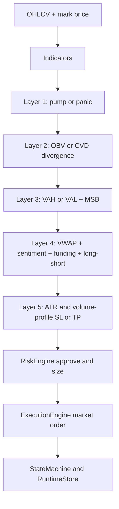

# Глубокий аудит ai-trader-bot и новый аудит

## Executive summary

Репозиторий заметно вырос по сравнению с ранней, более монолитной версией: корневой `main.py` теперь делегирует запуск в `app/main.py`, появилась V2-архитектура с `StateMachine`, `RuntimeStore`, `ExecutionEngine`, стартовой сверкой с биржей и тестами на перезапуск, идемпотентность и recovery. Это сильный шаг вперед: архитектурно проект уже не выглядит как «скрипт с ордерами», а как минимальный торговый runtime со state/reconcile/persistence слоями. Одновременно проект все еще нельзя считать production-ready из-за трех системных проблем: в репозитории по‑прежнему закоммичены реальные секреты в `.env`, CI настроен fail-open и пропускает упавшие тесты, а фактический runtime стратегии работает в деградированном режиме по данным Layer 4, потому что в цикл сейчас подаются `sentiment=50`, `funding=None`, `long_short_ratio=None`, то есть одна из заявленных фильтраций фактически отключена. fileciteturn64file0L1-L1 fileciteturn82file0L1-L1 fileciteturn49file0L1-L1 fileciteturn61file0L1-L1 fileciteturn3file0L1-L1 fileciteturn83file0L1-L1 fileciteturn38file0L1-L1

По стратегии картина смешанная. Идея layered short-on-pump в коде реализована не как «коротить всё, что растет», а как пятислойный фильтр: pump/panic detection, дивергенция, location+MSB, fake-signal filter, ATR/Volume Profile TP/SL. Это значительно лучше, чем простой RSI-overbought short. Но текущая реализация одновременно делает и **short на pump**, и **long на panic**; исполняет входы рыночными ордерами; не использует фильтр ликвидности и глубины стакана перед входом; считает только один реальный take profit, хотя генератор уже умеет строить `partial_tps`. В результате математическая идея выглядит лучше, чем ее исполнение. fileciteturn37file0L1-L1 fileciteturn38file0L1-L1 fileciteturn44file0L1-L1 fileciteturn53file0L1-L1

Главный вывод нового аудита такой: **архитектурные улучшения действительно внедрены**, но **операционная дисциплина и воспроизводимая оценка качества сигналов пока отстают**. В моем текущем балле это выглядит так: инженерная архитектура — **7/10**, защита живой торговли — **4/10**, стратегия как идея — **5/10**, воспроизводимость исследований и аудируемость результатов — **3/10**. Оценка снижена прежде всего из-за утечки секретов, fail-open CI, разрыва между production-alerts и backtest pipeline, а также потому, что канал сигналов в текущем V2-цикле не содержит достаточного набора данных для корректного последующего replay/backtest. fileciteturn30file0L1-L1 fileciteturn82file0L1-L1 fileciteturn70file0L1-L1 fileciteturn83file0L1-L1

## Что проверено и какие допущения приняты

В качестве базового runtime я принимал V2-ветку репозитория: корневой вход теперь идет через `app/main.py`, а старый `trading_loop.py` помечен как legacy/quarantined. Это важно, потому что качество бота сегодня надо оценивать именно по V2 control-plane, а не по старому монолитному контру. fileciteturn64file0L1-L1 fileciteturn9file0L1-L1 fileciteturn30file0L1-L1

По бирже я принял допущение, что целевая площадка — entity["company","Bybit","cryptocurrency exchange"] и в первую очередь линейные USDT-perpetual инструменты. Это следует из V2-адаптера, market feed и mini-backtest утилиты: в коде жестко используется Bybit V5 API, `category=linear`, символы нормализуются как `BTCUSDT`, а исторические свечи в backtest/forward replay тоже тянутся через `/v5/market/kline`. Официальная документация Bybit подтверждает, что endpoint `GET /v5/market/kline` используется для исторических свечей и поддерживает интервалы от `1` минуты до недельных свечей. fileciteturn52file0L1-L1 fileciteturn53file0L1-L1 fileciteturn70file0L1-L1 citeturn16search0turn17view0

По таймфрейму и universe я принял дефолты самого бота: V2 runtime по умолчанию использует `BOT_TIMEFRAME="1"` и `BOT_SYMBOLS="BTCUSDT"`, а legacy-конфиг тоже по умолчанию задает `TIMEFRAME="1"`. Поэтому без явной пользовательской переопределяющей конфигурации корректнее всего считать, что базовый режим исследования — 1-минутный скан и символы, заданные окружением, с дефолтом в BTCUSDT. fileciteturn31file0L1-L1 fileciteturn72file0L1-L1

Статус воспроизводимости deliverables у меня такой. Кодовый аудит и новый аудит внедренных улучшений — **выполнены полноценно**. Стратегический аудит логики — **выполнен полноценно**. Но независимый backtest именно по сообщениями канала в entity["company","Telegram","messaging platform"] и построение фактической equity/drawdown-кривой по каналу **не удалось воспроизвести честно**: текущий production-alert в V2 посылает только `ACTION symbol qty reason`, без `entry/tp/sl/confidence`, тогда как встроенный `mini_backtest_signals.py` требует CSV с колонками `time,symbol,direction,entry,tp,sl`. То есть production и replay сегодня не соединены в один проверяемый контур. Я не стал выдумывать P&L там, где проект сам пока не дает воспроизводимого трейла. fileciteturn82file0L1-L1 fileciteturn70file0L1-L1

## Аудит кода и архитектуры

Сильная сторона проекта — переход к более правильной торговой архитектуре: есть конфиг-валидация с fail-closed правилами для live, есть разделение обязанностей между `risk`, `execution`, `exchange adapter`, `state`, `persistence`, есть startup reconciliation и restart recovery. Именно это я считаю подтвержденным улучшением по сравнению с прежней версией. Но этот прогресс частично нивелируется несколькими критическими и высокими рисками, перечисленными ниже. fileciteturn31file0L1-L1 fileciteturn44file0L1-L1 fileciteturn48file0L1-L1 fileciteturn49file0L1-L1

| Файл / модуль | Назначение | Найденные проблемы | Severity | Что исправить |
|---|---|---|---|---|
| `.env` | Локальные секреты и runtime-переменные | В репозитории закоммичены реальные API keys и bot tokens. Это прямо противоречит migration notes, где указано, что секреты надо убрать из runtime path и ротировать исторические ключи. Это **критическая** операционная проблема. fileciteturn3file0L1-L1 fileciteturn30file0L1-L1 | Critical | Немедленно ротировать все биржевые ключи и токены Telegram/прочих алертов; удалить `.env` из истории git; хранить секреты только через environment/secret manager. |
| `.github/workflows/ci.yml` | CI/CD и базовая проверка репозитория | `pytest -q --disable-warnings || true` делает pipeline fail-open: тесты могут падать, а workflow останется зеленым. Также CI не запускает обязательный smoke/e2e testnet suite и не строит lock/constraints для воспроизводимости. fileciteturn83file0L1-L1 | High | Убрать `|| true`; запускать `tests/v2` как mandatory gate; добавить artifact upload coverage/junit; использовать constraints/lockfile. |
| `app/bootstrap.py` | Fail-closed конфиг и режимы runtime | Это один из подтвержденных плюсов: live требует `LIVE_TRADING_ENABLED=true`, запрета testnet/dry_run и явного `LIVE_STARTUP_MAX_NOTIONAL_USDT`. Но этот слой не гарантирует согласованность market-data окружения с execution-окружением, потому что сам feed создается отдельно в `app/main.py`. fileciteturn31file0L1-L1 fileciteturn57file0L1-L1 | Medium | Протянуть environment selection до market-data feed и валидации end-to-end, чтобы testnet/test/prod были консистентны по всем клиентам. |
| `app/main.py` | Основной V2-цикл | Здесь сразу три high-level проблемы. Во‑первых, `MarketDataFeed(base_url="https://api.bybit.com")` захардкожен на mainnet, даже если execution adapter работает в testnet. Во‑вторых, в цикл подаются `sentiment_index=50`, `funding_rate=None`, `long_short_ratio=None`, то есть Layer 4 живет в fallback-режиме. В‑третьих, production alert в Telegram/Discord содержит только `ACTION symbol qty reason`, без `entry/tp/sl/confidence`, что делает downstream replay и ручную фильтрацию сигналов слабой. fileciteturn82file0L1-L1 | High | Синхронизировать mainnet/testnet между feed и adapter; загружать реальные sentiment/funding/ratio; расширить alert schema до machine-readable payload. |
| `trading/signals/layered_strategy.py` + `core/signal_generator.py` | Логика стратегии | Стратегия не является строго short-only: она может делать `LONG_ENTRY` на panic. Это нормально как general reversal strategy, но не соответствует названию «short on pump», если цель — только шортовые сигналы. Также generator уже считает `partial_tps`, но runtime их не использует. fileciteturn37file0L1-L1 fileciteturn38file0L1-L1 | High | Либо переименовать стратегию в symmetric reversal, либо добавить hard gate `only_short_mode`; внедрить multiple TP/trailing logic в execution layer. |
| `trading/execution/engine.py` | Исполнение ордеров, retry, protective logic | Архитектурно модуль хороший: есть idempotency, retries, emergency protective close, restart recovery. Но исполнение по входу — чисто market order; нет pre-trade оценки spread/depth/expected slippage; нет лимитного режима для illiquid pumps. Это особенно опасно для стратегии против тренда. fileciteturn44file0L1-L1 | High | Добавить execution policy: market only при достаточной ликвидности, иначе passive/limit-with-timeout; добавить book-depth guard и max expected slippage. |
| `trading/risk/engine.py` + `app/main.py` | Approval, sizing, дневной стоп, cooldown | Сizing написан аккуратно, но risk-state обновляется только когда V2 сам отправил explicit `EXIT_*` intent и получил fill. Если позицию закрыл exchange-side stop/take-profit без явного локального exit-intent, то `record_trade_result()` может не быть вызван, а daily stop / cooldown / consecutive losses отстанут от биржевой реальности. fileciteturn33file0L1-L1 fileciteturn82file0L1-L1 | High | При reconciliation/ws events детектировать закрытие позиции с realized PnL и обновлять risk-state вне зависимости от источника закрытия. |
| `trading/state/persistence.py` | Restart-safe SQLite persistence | Наличие persist layer — подтвержденное улучшение. Но SQLite используется без WAL/synchronous tuning, а при corruption store переименовывает DB и стартует заново. Это практично, но означает риск тихой потери runtime-state/journal после сбоя диска или abrupt shutdown. fileciteturn49file0L1-L1 | Medium | Включить WAL, `PRAGMA synchronous=NORMAL/FULL` по политике, snapshot export и recovery procedure вместо silent reset. |
| `backtesting/backtest.py` + `backtesting/metrics.py` | Оффлайн backtest стратегии | Логика backtest полезна как sanity check, но она не compounding-aware: risk size считается от `initial_equity` на каждой сделке, а не от текущего equity. Sharpe annualization захардкожен как `365*24` и не зависит от реального timeframe. Это искажает метрики. fileciteturn69file0L1-L1 fileciteturn84file0L1-L1 | Medium | Сделать compounding equity, annualization на базе timeframe, моделирование overlapping positions и portfolio-level exposure. |
| `mini_backtest_signals.py` + `app/main.py` | Replay сигналов по логам | Встроенный mini-backtest уже знает, как прогонять сигнал вперед по Bybit-свечам, но требует лог с `entry/tp/sl/time`. Текущий production alert эти данные не отправляет. Это разрыв между тем, что бот публикует, и тем, что проект умеет проверить пост-фактум. fileciteturn70file0L1-L1 fileciteturn82file0L1-L1 | High | Ввести единый JSONL/CSV event log и публиковать в alert хотя бы `symbol, side, entry, sl, tp, confidence, signal_id`. |
| `ai/inference/model_service.py` | ML inference и schema checks | Проверка `feature_schema_mismatch` сейчас фактически мертвая: `actual_hash` считается не по runtime features, а снова по `expected_names`, поэтому этот guard не ловит реальные runtime drift cases. fileciteturn85file0L1-L1 | Medium | Считать `actual_hash` по фактическим runtime feature names/order и валидировать его против manifest hash. |
| `tests/v2/*`, `tests/test_live_execution_safety.py`, `tests/v2/fakes.py` | Test coverage | V2-тесты подтверждают реальный прогресс: есть проверки конфигов, execution, restart recovery, e2e dry run. Но legacy тесты по умолчанию skip, а основная V2 тестовая среда основана на `FakeAdapter`, то есть нет обязательного интеграционного теста на реальном testnet API в CI. fileciteturn57file0L1-L1 fileciteturn59file0L1-L1 fileciteturn60file0L1-L1 fileciteturn61file0L1-L1 fileciteturn58file0L1-L1 fileciteturn63file0L1-L1 | High | Оставить fakes для unit-tests, но добавить обязательный nightly/manual testnet verification и сделать его blocking для release. |
| `trading_loop.py`, `main_legacy_monolith.py`, `main.py.bak_working` | Legacy/backup артефакты | Они уже помечены как legacy/quarantined, но физически остаются в дереве репозитория и повышают риск операторской ошибки, особенно если кто-то запускает не тот entrypoint или берет старые паттерны как актуальные. fileciteturn9file0L1-L1 fileciteturn30file0L1-L1 fileciteturn68file9L1-L1 fileciteturn68file20L1-L1 | Low | Унести в `legacy/`, архивировать отдельной веткой или удалить из main. |

Если свести кодовый аудит к сути, то я бы сказал так: **архитектурный слой существенно улучшен**, **операционный слой еще не закрыт**, а **исследовательский слой пока недостаточно воспроизводим**. Именно поэтому у проекта сейчас высокое качество по форме runtime и умеренное качество по надежности результатов. fileciteturn30file0L1-L1 fileciteturn82file0L1-L1 fileciteturn83file0L1-L1

## Аудит стратегии short on pump

Текущая стратегия в коде устроена как layered reversal engine. Layer 1 ищет pump/panic через RSI, volume spike и пробой Bollinger/Keltner; Layer 2 подтверждает слабость/силу через OBV/CVD divergence; Layer 3 требует вход около VAH/VAL плюс market structure break; Layer 4 фильтрует фейки по sentiment/VWAP/funding/long-short-ratio; Layer 5 строит TP/SL через ATR и volume profile. Это хороший каркас: в нем есть и idea quality, и structure confirmation, и risk-aware exits. Но в production runtime один из слоев сейчас фактически обесценен нейтральной подачей данных, а исполняющий слой работает более грубо, чем предполагает сигнальный слой. fileciteturn38file0L1-L1 fileciteturn82file0L1-L1



Самая важная стратегическая проблема — runtime в `app/main.py` сейчас не подает в стратегию реальные данные по sentiment/funding/ratio. Вместо этого он каждый цикл выставляет `sentiment_index=50`, `sentiment_source="fallback_neutral_50"`, `funding_rate=None`, `long_short_ratio=None`. Внутри fake-filter это переводит Layer 4 в degraded mode. Иными словами, формально у тебя стратегия «многослойная», а практически один из слоев сегодня почти всегда работает как fallback. Это критично именно для anti-pump short, потому что crowding/funding — одна из немногих вещей, которая реально помогает отличать exhaustion spike от начала настоящего squeeze-trend. fileciteturn82file0L1-L1 fileciteturn38file0L1-L1

Вторая проблема — несоответствие между сигнальной точкой и способом исполнения. Layer 3 пытается выбрать хорошее **место входа** относительно VAH/VAL и market structure break, но `ExecutionEngine` входит через `place_market_order()`. Для short-on-pump это означает систематическое запаздывание: ты нашел логику «вход около перегрева», а исполнил по рыночной цене, когда свеча уже отдала часть движения или, наоборот, продолжила импульс. На высоковолатильных альтах это быстро съедает edge. Дополнительный минус — в live runtime нет обязательного liquidity/speed gate по спреду, depth и ожидаемому проскальзыванию; `MarketDataFeed` вообще не использует стакан при принятии решения. fileciteturn38file0L1-L1 fileciteturn44file0L1-L1 fileciteturn53file0L1-L1

Третья проблема — стратегия называется short-on-pump, но фактически остается двусторонней reversal-стратегией: на panic она умеет делать long. Если целью проекта является именно качественный short channel, я бы не оставлял это как «скрытую фичу». Это должно быть явно выражено в конфиге: `ONLY_SHORT_SIGNALS=true`, иначе у тебя бот, тесты, канал и аналитика говорят о разных вещах. fileciteturn37file0L1-L1 fileciteturn38file0L1-L1

С точки зрения risk management идея sizing у тебя разумная: `qty = equity * risk_pct / stop_distance`, а потом идет отсечение по `max_total_notional`, `max_symbol_exposure`, `max_leverage`, `min_qty`, `min_notional` и проверка liquidation buffer. Но live-реализация недостаточно хорошо покрывает случай, когда stop/take-profit закрывают позицию на стороне биржи без локального explicit exit-intent. Для anti-pump short это особенно критично: серия stop-outs и всплесков funding должна сразу останавливать торговлю по daily loss / cooldown / consecutive losses, а не ждать, пока локальный код сам сформирует `EXIT_SHORT`. fileciteturn33file0L1-L1 fileciteturn82file0L1-L1

По backtest-части я разделяю две вещи. Логика backtest по самой стратегии в `backtesting/backtest.py` существует и полезна как research harness, но она упрощает реальность: не компаундит equity, задает фиксированный annualization в Sharpe, считает ambiguous bar консервативно и не моделирует portfolio overlap. А отдельный `mini_backtest_signals.py` уже умеет replay сигналов по Bybit forward candles, но требует полноценный signal log, которого production V2 сейчас не пишет в достаточном виде. Поэтому честный вывод такой: **в коде есть basis для воспроизводимого бэктеста, но production telemetry до него еще не дотягивает**. fileciteturn69file0L1-L1 fileciteturn84file0L1-L1 fileciteturn70file0L1-L1

Что касается запрошенных метрик по сигналам из канала — P&L, winrate, max drawdown, Sharpe, expectancy и фактическая equity curve по сообщениям канала — я их **не утверждаю** в этом отчете, потому что у меня не было воспроизводимого экспорта истории канала, а текущий V2 alert schema сам по себе не несет нужных полей для replay. Подставлять «примерные» числа здесь было бы методологически неправильно. Вместо этого я оцениваю готовность самого проекта к такому replay как низкую, но исправимую. fileciteturn82file0L1-L1 fileciteturn70file0L1-L1

## Как решать, брать сигнал или пропускать

Если твоя цель — научиться **четко отбирать сигналы**, я бы не принимал решение по одному признаку вроде RSI или «бот написал SHORT». Для твоего бота лучше работает связка из **жестких фильтров** и **скоринговой рубрики**. Жесткие фильтры отсекают очевидно плохие сделки, а скоринг решает, брать ли полный размер, половину размера или вообще не входить. Эта схема хорошо соответствует твоему layered-подходу. fileciteturn38file0L1-L1 fileciteturn33file0L1-L1

Сначала жесткие reject-правила. Сигнал надо пропускать, если он старше одного бара твоего рабочего ТФ; если бот не может дать валидный stop-loss; если после комиссий и реалистичного проскальзывания первая цель дает меньше `1.5R`; если ликвидность инструмента слабая и рыночный вход может сдвинуть цену больше чем на 0.15–0.20%; если нет подтвержденного structure break, а есть только «перекупленность»; если цена уже ушла от зоны входа более чем на `0.3–0.5 ATR`; если спред расширен и стакан пустой; если ты уже сидишь в correlated short по тому же рыночному импульсу. Эти правила не идут вразрез с кодом — они просто делают тот execution discipline, которого сейчас не хватает runtime. fileciteturn38file0L1-L1 fileciteturn44file0L1-L1 fileciteturn53file0L1-L1

Дальше — скоринг. Я предлагаю следующую практическую шкалу на 100 баллов.

| Критерий | Вес | Как оценивать |
|---|---:|---|
| Pump exhaustion / panic exhaustion | 20 | RSI, volume spike, breakout за пределы bands — сильные экстремумы дают 15–20, слабые 0–10 |
| Weakness / strength confirmation | 15 | Наличие OBV/CVD divergence в сторону входа |
| Structure break | 20 | Подтвержден ли MSB/EMA cross именно после экстремума |
| Location quality | 15 | Вход рядом с VAH/VAL/локальным экстремумом, а не «посреди свечи» |
| Crowd / funding context | 10 | Предпочтительно, чтобы crowd был перекошен против будущего возврата; без данных ставить не выше 4/10 |
| Liquidity / spread / slippage | 10 | Хорошая ликвидность и узкий спред = 8–10, иначе 0–5 |
| Risk-reward after costs | 10 | После fees/slippage первый адекватный TP должен оставлять не меньше 1.5R |

Интерпретация шкалы должна быть жесткой. **80–100** — можно брать полный размер по твоему риск-лимиту. **65–79** — только половина базового размера. **50–64** — бумажное наблюдение или микроразмер. **Ниже 50** — сигнал пропускать. Важная деталь: если не выполнен хоть один hard reject filter, итоговый балл уже не спасает сделку. Для short-on-pump это особенно важно, потому что контртрендовые ошибки дороже, чем ошибки в направлении тренда. fileciteturn33file0L1-L1 fileciteturn38file0L1-L1

Если упростить это до человеческой формулы, то качественный short-сигнал для тебя сейчас должен выглядеть так: **бот увидел экстремум → есть явная слабость по потоку/объему → есть структурный надлом → вход еще не убежал → ликвидность достаточная → стоп логичный → первый target окупает издержки**. Если хотя бы два средних блока из этой цепочки слабые, сделку лучше пропустить. Именно так ты перестанешь «торговать сигнал», а начнешь торговать **контекст сигнала**. fileciteturn38file0L1-L1

## Новый аудит внедренных улучшений и приоритетный план

Подтверждено, что часть прошлых улучшений уже реально внедрена. Первое: проект действительно переведен на V2 entrypoint через `app/main.py`. Второе: startup reconciliation, state machine, persistence и restart recovery реально присутствуют не только в коде, но и в тестах. Третье: live режим сделан fail-closed и требует явного enable flag и notional cap. Четвертое: `.gitignore` и `config/secrets.env.example` действительно показывают попытку привести проект к более безопасной модели конфигов. Пятое: CI появился, и это тоже движение вперед. fileciteturn64file0L1-L1 fileciteturn48file0L1-L1 fileciteturn49file0L1-L1 fileciteturn61file0L1-L1 fileciteturn31file0L1-L1 fileciteturn65file0L1-L1 fileciteturn83file0L1-L1

Но остаются проблемы, которые я считаю блокирующими для следующего уровня зрелости. Самая неприятная — миграционные notes декларируют cleanup секретов и историческую ротацию, а фактический `.env` с реальными ключами все еще лежит в репозитории. Вторая — CI формально есть, но практически не может остановить регрессию. Третья — strategy layer design уже сложный, а реальные входные данные и alert schema все еще слишком бедные. Четвертая — production and research path разделены: бот торгует одно, валидируется другое, канал публикует третье. fileciteturn30file0L1-L1 fileciteturn3file0L1-L1 fileciteturn83file0L1-L1 fileciteturn82file0L1-L1 fileciteturn70file0L1-L1

Ниже — мой приоритетный план по эффекту и трудозатратам.

| Приоритет | Задача | Effort | Impact |
|---|---|---:|---:|
| Немедленно | Удалить `.env` из git history и ротировать все ключи/токены | 0.5–1 день | Очень высокий |
| Немедленно | Сделать CI fail-closed и вынести V2 тесты в обязательный gate | 0.5 дня | Очень высокий |
| Очень скоро | Соединить runtime alerts и replay log в единую схему событий | 1–2 дня | Очень высокий |
| Очень скоро | Подавать в strategy реальные `funding`, `long_short_ratio`, `sentiment`, а не fallback | 1–2 дня | Высокий |
| Очень скоро | Добавить liquidity/spread/slippage gate перед market execution | 1–2 дня | Высокий |
| Скоро | Учитывать exchange-side закрытия в `RiskEngine.record_trade_result()` | 1–2 дня | Высокий |
| Скоро | Сделать short-only mode как отдельный policy switch | 0.5 дня | Средний/высокий |
| Скоро | Переделать backtest на compounding equity и корректный Sharpe annualization | 1 день | Средний |
| Потом | Убрать legacy/backup файлы из main | 0.5 дня | Средний |
| Потом | Ввести constraints/lockfile и reproducible deployment profile | 1 день | Средний |

Ниже — три самые полезные точечные правки.

Патч для CI: сейчас workflow должен падать при упавших тестах, а не проходить. Это исправление непосредственно следует из текущего `ci.yml`. fileciteturn83file0L1-L1

```yaml
- name: Run unit tests
  run: |
    pip install pytest
    pytest tests/v2 -q --disable-warnings
```

Патч для schema hash: текущая проверка drift в `ModelService` считает `actual_hash` по `expected_names`, из-за чего guard фактически бесполезен. fileciteturn85file0L1-L1

```python
expected_hash = self.artifacts.feature_schema_hash or compute_feature_schema_hash(expected_names)
actual_hash = compute_feature_schema_hash(runtime_names)
if expected_hash and expected_hash != actual_hash:
    return InferenceResult(
        probability=0.5,
        horizon=8.0,
        model_enabled=False,
        reason="feature_schema_mismatch",
    )
```

Патч для production-alert schema: прямо сейчас каналу не хватает данных для ручного отбора и последующего replay. Минимальный payload должен нести `entry/sl/tp/confidence/signal_id`. Это логически вытекает из текущих ограничений `app/main.py` и `mini_backtest_signals.py`. fileciteturn82file0L1-L1 fileciteturn70file0L1-L1

```python
if intent.action in (IntentAction.LONG_ENTRY, IntentAction.SHORT_ENTRY) and outcome.accepted:
    msg = (
        f"{intent.action.value} {symbol}\n"
        f"entry={mark_price:.6f}\n"
        f"sl={float(intent.stop_loss or 0):.6f}\n"
        f"tp={float(intent.take_profit or 0):.6f}\n"
        f"qty={outcome.filled_qty:.6f}\n"
        f"confidence={intent.confidence:.2f}\n"
        f"signal_id={intent.metadata.get('legacy_signal_id','')}"
    )
    _send_alerts(alerters, msg)
```

И последний, стратегически самый полезный патч — перестать жить на fallback Layer 4 в live/runtime. Сейчас это один из самых больших скрытых источников недоработки. Вместо статических `50/None/None` надо уже в основном цикле подтягивать snapshot market-context и передавать его в pipeline/strategy. Это не косметика, а реальное включение обратно одной из защит от fake reversals. fileciteturn82file0L1-L1 fileciteturn38file0L1-L1

## Ограничения и открытые вопросы

Я сознательно **не привожу выдуманные метрики** по Telegram-каналу, потому что в текущем состоянии проекта production-alert schema не дает полного трейл‑сета для честного replay, а независимый экспорт истории канала в этой среде я не смог воспроизвести так, чтобы не подменять факт предположением. Поэтому фактические channel-based P&L, winrate, max drawdown, Sharpe, expectancy и equity/drawdown графики в этом отчете не заявляются как проверенные результаты. fileciteturn82file0L1-L1 fileciteturn70file0L1-L1

Если формулировать финальный вывод в одном предложении, то он такой: **бот уже стал существенно лучше как система исполнения и контроля состояния, но пока еще не стал по‑настоящему проверяемой и дисциплинированной торговой системой**. Самый короткий путь к следующему уровню — закрыть секреты и CI, затем соединить production-alerts с replay/backtest, затем включить реальные Layer 4 данные и только после этого уже заново сравнивать качество сигналов канала с фактическим рынком. fileciteturn30file0L1-L1 fileciteturn82file0L1-L1 fileciteturn83file0L1-L1